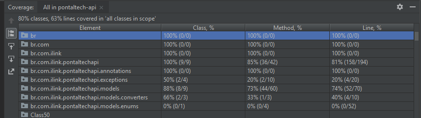
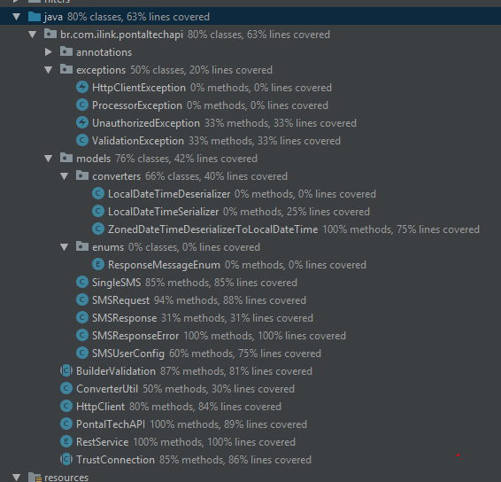
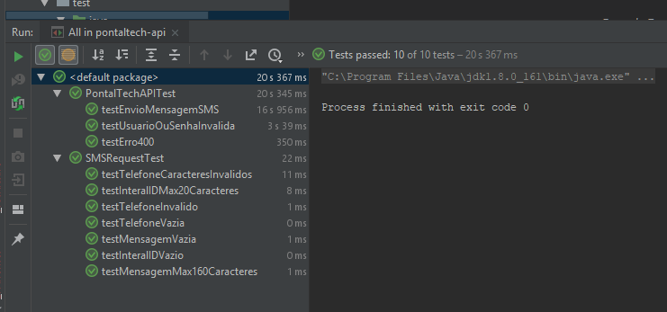

# API PontalTech

#### Descrição
> API para chamadas a serviços de envio de SMS da empresa [PontalTech](https://docs.pontaltech.com.br/pointer-sms-api) SMS.

## Unidades de Test
Cobertura de código:
 

 
 

Tests implementados
 

## Como usar
Configurações
    
    //Dentro do arquivos de profile tem as configurações de URL, usuário e senha, mas é possível
    //informar usuário e senha em Runtime.
      src/main/filters/dev.properties
      src/main/filters/prod.properties

  Criando resquisição
    
    //Sem DDD
    PontalTechAPI.SMSRequest requisicao = PontalTechAPI.SMSRequest.builder()
        .para("6296521489")
        .para("6296521482")
        .para("6296521483")
        .mensagem("Mensagem")
        .codigoInterno("3245234")    //Id interno da Callink
        .build();
        
  Enviado SMS
  
    List<PontalTechAPI.SMSResponse> resps =
          PontalTechAPI.preparar(requisicao).enviar();
    //Retorna uma lista dos SMSs enviados para cada numero adicionado

  Verificando status de Envio. *(Somente por período)*
      
      PontalTechAPI.SMSRequestCheck requestCheck =
            PontalTechAPI.SMSRequestCheck.builder()
              .dataInicio(LocalDateTime.now().minusMinutes(5))
              .dataFim(LocalDateTime.now())
              .build();
              
      List<PontalTechAPI.SMSResponse> reports =
                    PontalTechAPI.preparar(requestCheck).check();        
    
  Espeficicando usuário e senha
  
    PontalTechAPI.config(
              PontalTechAPI.SMSUserConfig.build("USUARIO", "SENHA")
            )
            .prepare(req)
            .envia();
    
#### Dúvidas 
[by Wellton S. Barros - makotostudiodev@gmail.com](https://github.com/Cafecanudo/pontaltech-api)